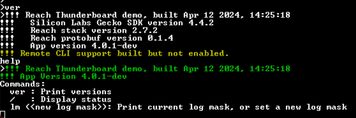
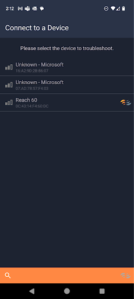
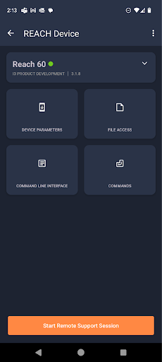
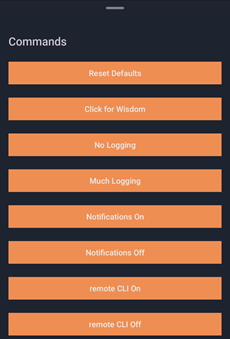
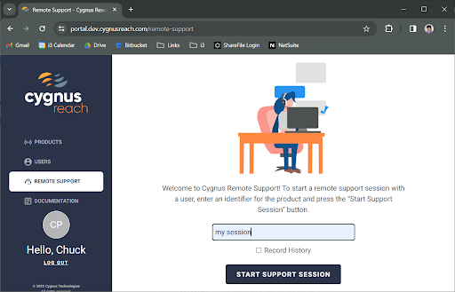
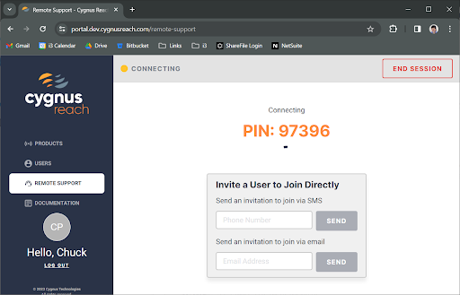
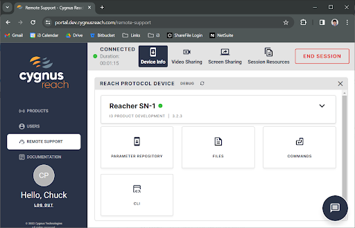
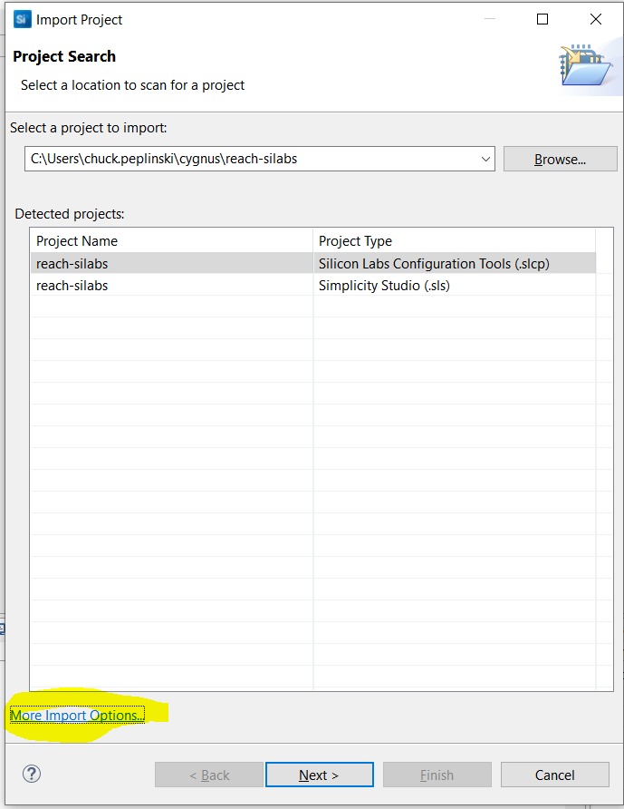
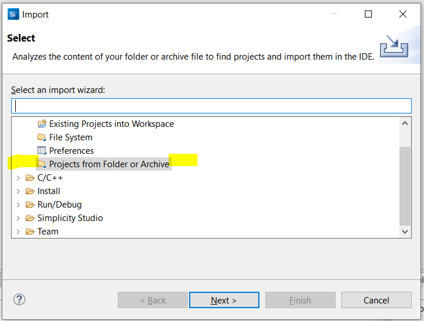
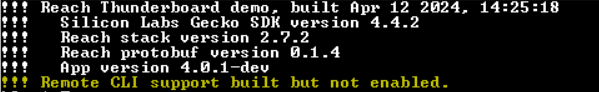

# Getting Started with Cygnus Reach

I3 Product Design

Version 3.02

Date        March 20, 2024

***The project structure has changed between v2 and v3 of this document.***

# Executive Summary

Cygnus Reach is a system to provide customer support to users of embedded IoT (Internet of Things) devices.  This support is also very useful to developers of such systems.  

In case you aren’t familiar with Cygnus Reach, here are two links with some overview.  

* [https://cygnustechnology.com/](https://cygnustechnology.com/)
* [https://cygnustechnology.com/see-reach-in-action/](https://cygnustechnology.com/see-reach-in-action/)

This package provides code to exercise the Cygnus Reach system using the “Thunderboard”, which is a common IoT development board.  This allows a user to evaluate the mobile apps and the web interface that are involved.  This document briefly describes how to run the prebuilt demo and then how to rebuild the demo to make a more detailed evaluation.  

The SDK’s necessary to develop customized mobile app and web pages for Reach access are available through your Cygnus sales representative.  While the demo works with the Silicon Labs hardware, the system is deployed on other platforms.

## Audience

The Cygnus Reach Evaluation Kit for the Silicon Labs Thunderboard assumes that the user is familiar with the development of IoT devices using “Simplicity Studio”, the Silicon Labs development system.  The Silicon Labs web site contains quite a bit of introductory material which is beyond the scope of this document.  A wider audience will be interested in the demo when the device is programmed.

## Version History

1.01 : January 2024, first public release.

2.01:  February 9, 2024.  Adds features such as parameter notifications.  Provided with a separate release note.

3,01: March 12, 2024.  The project structure has changed allowing for complete import.

# Running the Demo

The demo requires a Reach enabled IoT device.  The Thunderboard fills this role conveniently.  The Nordic nRCP is also an option, but this document describes the Silicon Labs demo.

## Preparation

* Obtain the Cygnus Reach firmware package from this site on github:
  
  * [https://github.com/cygnus-technology/reach-firmware](https://github.com/cygnus-technology/reach-firmware)

* Procure a Silicon Labs Thunderboard (SLTB010A).  A quick google finds these common at Digikey and Mouser.  The cost is around $42.

* If you are going to rebuild the Thunderboard program, install Simplicity Studio from Silicon Labs.
  
        [https://www.silabs.com/developers/simplicity-studio](https://www.silabs.com/developers/simplicity-studio)
  
  * The code is updated to match version 5.8 with Gecko 4.4.0.
  * For any Linux users, be aware that the default installation can go a lot faster if you set the make to use multiple threads.

* If you are only going to flash the prebuilt binary, you can more quickly install only the Simplicity Commander tool.  Google “[download Simplicity Commande](https://community.silabs.com/s/article/simplicity-commander?language=en_US)r” and choose the version you like.  They offer Windows, Mac and Linux.

* Install the Cygnus Reach application on your mobile device.  You can find an appropriate version in the Google Play Store and in Apple’s App Store.
  
  * iOS: 
    * [https://apps.apple.com/us/app/reach-bluetooth-analyzer/id1500040087](https://apps.apple.com/us/app/reach-bluetooth-analyzer/id1500040087)
  * Android
    * [https://play.google.com/store/apps/details?id=com.reach_android&pli=1](https://play.google.com/store/apps/details?id=com.reach_android&pli=1)

## Programming the Device

* Connect your PC to the USB port on the Thunderboard.  
* Launch Simplicity Commander.

* Choose the kit in the upper left.  

* Select “prebuilt/reacher-tboard-v352.hex” (or the latest) for flashing.  This includes both the bootloader and the application.  Separate bootloader and app hex files are also available.

* Poke the “Flash” button.  The program will boot when the download is complete.

* Connect a serial terminal to the “JLink CDC UART Port” exposed by the Thunderboard.  It runs at the typical 115200,N,8,1.  

* When the board is running it should respond to a carriage return with a prompt and the “ver” command should print a banner.  The help command prints help.

* You should start to see a console like shown here.
  
  
  ## 
  
    Connecting with the Cygnus App

* Open the Cygnus app on your phone and select this device.  You can see that it has the Cygnus logo.  The app can also view the characteristics on other BLE devices.

* You can pull down the name tab to see the complete device info.

* Poke the Device Parameters button.  This will bring up the basic parameter inspection frame.  
  
  * You can edit parameters here.  
  
  * Note the different types of supported parameters.
  
  * Parameter ID 13 turns the yellow LED on and off.
    
    * The blue LED monitors USB activity.
  
  * Parameter ID 23 is increasing.  Refresh to see that.
    
    Reach provides for a remote command line interface (CLI).  The Thunderboard provides a CLI on the USB based serial port.  Reach also supports a remote CLI using the app.  This can be very helpful in development and troubleshooting.
    
    
    Commands provide a simple way to execute a function on the device.  The command tab has several useful functions.

* You can enable and disable the remote command line interface.

* You can adjust the amount of serial port logging.
  
    Reach supports high speed data transfer as “files”.  

## File Access and the Debug Interface

The file access features of Cygnus support the efficient transfer of larger blocks of data.  The “simple” interface interacts with files on your phone and gives you the option of emailing received files.  The debug interface gives you more control.  Access the debug interface from the three dots in the upper right corner.

Here a button represents each of the basic message commands in the Reach protocol.  The phone issues the request and the resulting action is printed on the screen.  The response is shown in hex.  The message is decoded into a JSON like format.  The hex bytes that were sent are not displayed here.  They are visible on the serial console of the device.

You can exercise finer control over the file operations on the debug screen.  First minimize logging using command 3.  Then select a fairly large size to read.  These tests send synthetic data, just increasing numbers to exercise the transfer rate.  You can experiment with the Acknowledgement rate and easily achieve transfer rates over 200kbps.

## The Serial Console

By default you see messages on the serial console as illustrated below.

* A banner is printed at startup.
* The yellow text about the PHY indicates we are connected to the phone.
* The magenta text indicates we have received a new prompt from the phone.  The hex bytes are printed.  This is the “wire” log.
* The cyan text prints what is decoded or to be encoded.  This is the “reach” log.  In this illustration the request for device info is answered.
* Finally, the command “lm ?” shows you the bit field values of the log mask.  You can enable or disable various bits of logging.
  
  The command pane allows you to enable the remote CLI.

The remote command line interface (CLI) is disabled by default.  When enabled, the command line of the device is accessible on the phone.

Rather verbose logging is enabled on the device by default.  Commands are provided to minimize and maximize the logging.   More finely grained control of the logging is provided through the CLI.

You can experiment with the file transfers.  When all logging is disabled (command “lm 0” on the device console) and the “ack rate” is set relatively high (say 100), a file read transfer rate over 300kbps is easily achieved.  Write transfer rates are over 100kbps.

## The Web Interface

The remote access capability of Cygnus relies on a mobile device (a phone) which is near the IoT device to act as a relay to a support engineer located remotely.  The end user who needs help can connect to the device with their phone and then connect to a support engineer who has visibility into the device.  You can demonstrate this using this kit.  

1. Complete the demo of the Cygnus app to verify the device.
2. Go to [https://cygnustechnology.com/](https://cygnustechnology.com/).  You will need to create an account.  This account allows you to evaluate the system.  It’s immediately granted.  It doesn’t confer enough rights to support the deployment of a real product.  Full product support requires a licensing agreement that is available from your Cygnus sales representative.
3. Having created an account you are invited to start a support session.  It may take a few minutes for the account to become active to access this page.  Enter an arbitrary name for the session.  This allows the session to be recorded for later reference.

Clicking on “Start Support Session” brings you to a PIN page.

Open the app on your phone and select “Start Remote Support Session” at the bottom of the page.  Enter the PIN.  Accept the permission request to start “recording or casting with Cygnus Reach”.

Select “Device Info” on the web page.  You see what is essentially the same interface as you see on the phone.

You can initiate a video sharing session which will allow the support engineer to see what is happening in the device.

You can also see the phone’s screen and chat with the user.

# Building the Demo

You can rebuild the application and modify it to your needs.  The process is described here.  It assumes that you have already run the demo on a Thunderboard.

## Import the Project

Earlier releases had you build up the project from the SiLabs "empty" example.  This is replaced with a direct import of the entire project.  If you have an existing github clone, update it to the latest master (tagged 2.5.3).  Then command "git submodule update --init" to get the matching submodule.  The Reach-c-stack is provided as a submodule because multiple projects use the C stack.

Right click in the project explorer and select "Import->MCU Project".  

Choose the "**More Import Options**" at the bottom of the dialog box.

Choose "**Projects from Folder or Archive**". Navigate to the reach-firmware directory you cloned and complete the import of an Eclipse project.

Click on “Next”.

This should bring the "reach-silabs" project into your workspace and it should build as is.  

You should be able to “Debug As” a “Silicon Labs ARM Program” by right clicking on the project in the explorer.  You may need to set up a debug configuration.  You should see the startup banner in your serial console with the new build date.

The Cygnus app should be able to connect to you.

By default the advertised name will contain the last three octets of the system ID.  You can use the “sn” command to set a device serial number and then this will be advertised.  This demonstrates how each Reach device can have a unique name.  

You might also note that the first time you run the program it will print red as it initializes the non-volatile storage.

### Adding Reach to another SiLabs Project

The reach-silabs demo depends on a few components on the Thunderboard.  You may need to bring these in to your SiLabs project:

- Iostream_retarget_stdio
  1. Depends on iostream_usart_core
- CLI Instance
  2. Create an instance “inst”
- Iostream_usart
  3. Create an instance named “vcom”
  4. Disable flow control.
  5. Convert \n to \r\n
- Iostream_stdlib_config
- Tiny Printf
- Simple LED (LED on the Thunderboard)
  6. With instance led0 connected GPIO B0

## Beyond the Demo

The source package includes a “Programmers Intro” document.  It contains a lot more background about the Reach package which should be helpful as you customize it for your own purposes.
