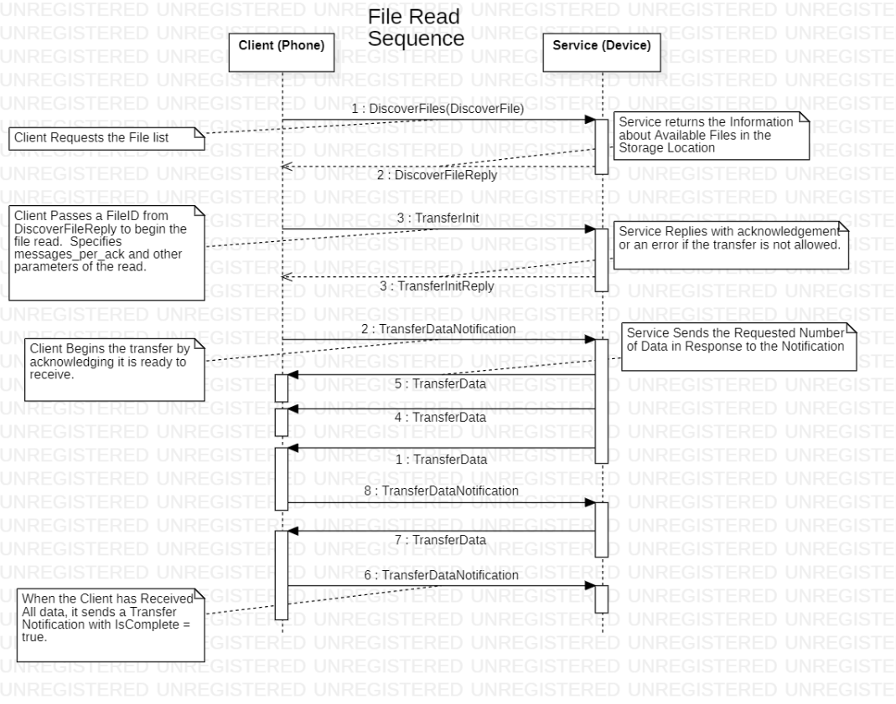

# Cygnus Reach Programmers Introduction

I3 Product Design

Version     3.3

Date        June 6, 2024

# Executive Summary

Cygnus Reach is a system to provide customer support to users of embedded IoT (Internet of Things) devices.  This support is also very useful to developers of such systems.  

In case you aren’t familiar with Cygnus Reach, here are two links with some overview.  

* [https://cygnustechnology.com/](https://cygnustechnology.com/)
* [https://cygnustechnology.com/see-reach-in-action/](https://cygnustechnology.com/see-reach-in-action/)

This package demonstrates the code in the device.  It’s a small part of the Cygnus ecosystem.  This document describes the design of the Cygnus Reach IoT device platform as implemented on a common Silicon Labs SoC.  A companion “Getting Started” document provides more introduction.  

The Cygnus Reach concept has some history at i3 where it has been deployed in a series of products.  This version is effectively a rewrite from the ground up.  It is designed to be deployed more widely with less customization required.

The SDK’s necessary to develop customized mobile app and web pages for Reach access are available through your Cygnus sales representative.

## Audience

This document is addressed to the embedded developer who is considering using the Cygnus Reach system in a product.  The authors assume that the audience has some familiarity with the Cygnus Reach concept.  Cygnus Reach includes features such as video and screen sharing that are quite independent from the embedded device. This document is about the embedded device portion of the system.

## Version History

1.1 : January 8, 2024, first public release.

2.0:  February 9, 2024.  Adds features such as parameter notifications.  Provided with a separate release note.

3.0: March 12, 2024.  The directory structure of the code is changed to simplify maintenance.

3.1: March 20, 2024. Editing pass to reflectd the latest (stack 2.5) changes.

3.3: June 6, 2024: More overview.

# Product Vision

The Reach stack enables the embedded system to be in contact with a mobile device over BLE for support and for development.

* Cygnus Reach is about supporting embedded devices.  The Cygnus Reach vision is to be a framework that is easily deployed into a range of products.  This requires several supporting components that are part of a larger ecosystem.
* Customer support technicians are one user of Cygnus Reach.  But the product vision is for the Cygnus Reach device info interface to be of critical utility to the embedded developer.  Hence Cygnus Reach is not bolted on to an existing product but rather built in from the ground up.
* The embedded developer must be able to expose the capabilities and debugging features of a device without creating a special web page.  The vision is to enable the embedded developer to construct the device info view without involving app or web developers.  This recommends a generic “display” client and an efficient data description mechanism.

# Overview

A typical Cygnus Reach system has at least two components:

* An embedded device acting as a “server” for its “device info” page.
* A web page or an app with a rich user interface acting as a “client” to display the device info page.

A mobile device may act as a “relay” to connect the embedded device to a web client.  The mobile device could also be the client on its own.

Bluetooth Low Energy (BLE) is most commonly used to communicate with the supported device, but other interfaces are possible if they are more appropriate.  

The embedded server device and the display client must share a common language.  This is the Reach Protocol, described in a separate document. The interface is defined using “protobufs” to leverage the rich feature set supplied in multiple languages.

Reference implementations of embedded systems are available.  The Thunderboard demo runs on Silicon Labs very small BLE demo board.  The OpenPV reference version runs on an Enovation display.  Both talk to Android and iOS mobile devices.

The key features of the implementation include:

* Organization into pages that are convenient for users.
* A standard way to identify the device and its firmware version(s).
* A “parameter repository” to access control and status variables using a key-value pair model.
* Access to a command line interface
* A “file access” mechanism that supports high rate transfers of larger blocks of data.
* A simple means to issue “commands” to the device.

The three demo systems illustrate Reach on systems of different complexity.  The Linux based OpenPV displays from Enovation are an example of Reach in a sophisticated system.  The reach-silabs Thunderboard demo shows Reach with no OS as appropriate for tiny embedded systems.  The "reacher-nfc" demo shows Reach running on a Nordic development board.  Reach can certainly be deployed in everything in between, and there is ongoing development in other common systems.

The three system approach to support (device, phone, web page) is a key concept.  This acknowledges the three users in the system.  The product user has access to an embedded device as well as a mobile phone.  The support engineer uses a web browser so as to display data on a larger screen.  The embedded system designer is the third user, as the embedded system builder must include the support required.

A proper Cygnus Reach system design includes much input from customer support engineers.  The Cygnus Reach system exists to facilitate field support.  Hence the information presented to the support engineers must be what they need.  With new products the embedded system designer often has no customer support engineers available to provide design guidance.  Hence Cygnus Reach systems are often deployed in two phases.  The first phase exposes the things that the embedded system designer finds necessary.  The second phase tunes this to emphasize the things customer support needs to see first.

* * * *

## Typical Interactions

A typical Reach session follows a pattern like this:


The exchange always begins with the client requesting device information.  The server replies.  The client can then request more information such as the parameter data.  The response packets are limited in size so as to fit in a Bluetooth Low Energ (BLE) packet.  The response may require several "continued" packets.  A subsequent section titled "Multi-Message (Continuing) Transactions" gives some more background on how continuing messages are handled.
The device information response tells the client what services are supported by the server.  The client can then request data from each service as necessary.  

A number of design patterns used by Reach in multiple places.
1) The prompt-response pattern, where the server provides data in response to a prompt.
2) The discovery pattern, where the client discovers what the server can provide.
3) The continuing message pattern, where requested data is provided in several packets of size appropriate for the transport mechanism.
4) The notification pattern, where the server provides a message to the client without a prompt.

This basis allows a simple system to deliver much utility.

* * * *


## Bluetooth Low Energy (BLE)

The Reach protocol assumes that there exists a reliable underlying transport layer.  The protocol is initially deployed using the Bluetooth Low Energy transport protocol.  The implementation of the Reach stack is easily customized to fit the constraints of the available transport layer.

Reach is most commonly deployed over BLE.  Reach messages are configured to fit efficiently into the 244 byte limit on BLE packets.  Reach over BLE requires a single characteristic. When presented on a BLE interface, the following interface must be implemented. This standard allows for immediate recognition by and compatibility with a Cygnus capable app.

**REACH BLE Service:**

UUID: edd59269-79b3-4ec2-a6a2-89bfb640f930

**Characteristic:**

The single REACH API characteristic is all that is needed to enable access to the protocol. Client messages sent as individual characteristic writes and server responses are sent asynchronously as notifications.

<table>
  <tr>
   <td><strong>Field</strong>
   </td>
   <td><strong>Description</strong>
   </td>
  </tr>
  <tr>
   <td>Name
   </td>
   <td>REACH API
   </td>
  </tr>
  <tr>
   <td>UUID
   </td>
   <td>d42d1039-1d11-4f10-bae6-5f3b44cf6439
   </td>
  </tr>
  <tr>
   <td>Type
   </td>
   <td>String
   </td>
  </tr>
  <tr>
   <td>Length
   </td>
   <td>Variable - up to max BLE APDU
   </td>
  </tr>
  <tr>
   <td>Properties
   </td>
   <td>Write, Read, Notify
   </td>
  </tr>
</table>

**Advertisement:**

The BLE device must advertise this UUID so that mobile apps can identify it as a Cygnus device.  Note that the “Generic Access” service must also advertise to support long device names.


### Other Transport Protocols

Reach can be implemented on other protocols.  MQTT and CAN are often discussed.  The CAN ecosystem includes a transport layer which is well suited to deliver Reach.  Reach over CAN would be appropriate to connect multiple Reach "endpoints" in a device.

## Protobufs

The Reach communication protocol is implemented using Google's open source "protobuf" tool.  The big advantage of this tool is how easily it is used on the client side where Reach devices are addressed using multiple high level languages like Kotlin, Swift, and C#.  All of these languages rely on garbage collection to support memory allocation.  Since C does not support garbage collection, we elect to use static buffers to implement the protobuf structures.

The reach.proto file is available on the cygnus-technology github site in the reach-protobuf repository.  The authors don't expect users to modify the .proto file as it defines the communication standard.  

We use nanopb to convert the .proto file into C structures. Following nanopb guidelines, we use a .options file to avoid the use of malloc(). All arrays are converted to fixed sizes which are set in the .options file. The .options file is generated using a python script, reach_proto\proto\preprocess_options.py. This reads in reach-c-stack/includes/reach_ble_proto_sizes.h and a prototype of the options file. It outputs an options file that reflects the sizes set by the device. The sizes here are optimized for efficient BLE transfer. A system that does not use BLE could adjust these sizes. The UI applications are designed to respect these size constraints that are advertised in the device info structure.

## System Structure

The Thunderboard demo has two parts, namely a “server” written in C and a “client” written in Kotlin or Swift or typescript.  The demo server we describe here runs on a Silicon Labs (SiLabs) Thunderboard.  It advertises itself as a Reach device on BLE.  Android and iOS mobile apps are available as the demo client.  These are available in the corresponding play/app store.  Cygnus also supports a web client.

All of the Reach code, including demo applications for Silicon Labs and Nordic hardware platforms are available on the Cygnus Technology github site: 

    ([https://github.com/cygnus-technology](https://github.com/cygnus-technology))

The code can be seen as three parts.  The “app” is specific to the product, which is the demonstration by the reach-silabs program.  A protobuf module defines the Reach protocol and is shared with other systems.  The C language “Reach stack” (reach-c-stack) is reusable code that implements the Reach protocol with an appropriate interface to the app.  The entire set is built to port easily to other systems, whether in the SiLabs ecosystem or other BLE centric systems like those from Nordic.  The reach-silabs demo includes two files that target the SiLabs BLE interface.  These use a small and well defined interface to the rest of the stack.  

How to build and run the demo is described elsewhere in the “Getting Started” document.

## Porting the Demo

We encourage you to run the reach-silabs demo as is on the Thunderboard as it gives you a concrete reference.  This section outlines the process of porting the code to another system.  Here I assume it is a C project.  

The SiLabs demo uses no RTOS.  Everything goes through an event loop which is part of the SiLabs BLE architecture.  The Nordic demo uses the Zephyr RTOS.

The recommendation in general is to bring up your application so that it behaves just like the Reach demo, and then go on to customize it for your own usage.  The rest of this document attempts to give some background to better understand the application.

The demo application can be configured to print out the “wire” traffic in the form of the bytes sent over BLE.  This can be a helpful reference when porting.

A similar demo version is available for the Nordic nRCS.  The Enovation Systems OpenPV platform also supports Reach.

### Porting Tasks

The Getting Started document includes the necessary instructions if you are porting to a SiLabs system.  The following is a very general outline.  It's helpful to consider the task of getting your device to respond to the Reach client in some isolation from the task of customizing you list of parameters and service.

1. Configure the BLE stack to advertise the Reach characteristic.

2. Begin by getting your BLE to work.  Get your system to advertise the Reach characteristic.

3. Next drop in the reach-c-stack folder.  

4. The top level src and includes directories contain files that are designed to be customized for your application.  These are application specific implementations of the "weak" callback functions.  A couple of files have "silabs" in their names, and these connect the Reach stack to the BLE stack.  Other files like "params.c" implement what can be thought of as a dummy database which you can use for testing.

Now that you are talking to the client you can focus on customizing the services to meet your needs.

## Directory Structure

The “reach-silabs” project uses this top level directory structure.  

### src and include folders

The src and include folders at the top level of the project implement the callbacks that are required for the Reach stack to operate.  This includes application specific source files such as src/params.c which implements the callbacks required for cr_params.c.  There is generally a pair of files for each Reach "service," one in the "app" and one in the stack.

The two silabs specific files (reach-silabs.c and silabs_cli.c) are also present here.

The include folder provides reach-server.h.  This is the compile time configuration file.  It #defines macros that enable or disable features of the system.

### reach-c-stack

The directory (git submodule) “reach-c-stack” is designed to be used unchanged by multiple projects.  There is no “silabs” dependent code here.  All dependencies are to be satisfied by callback functions.  The sources are provided to help you understand and debug.  If you believe changes are appropriate, feel free to submit a ticket and a pull request on github.

* The reach-c-stack provides the portable core of reach.  A user should not have to change this.  It could be provided as a library but we choose to provide it in source form.
* Reach source code is found in the "src" and "include" directories.
* A "third_party" folder contains utilities from the open source web.
* The reach-c-stack defines the “weak” functions that the app must implement.
* It includes a logging function which relies on printf().
* A "docs" directory includes the source for a web page which includes Doxygen generated API references.  This is accessible on the github site.
* reach.pb.c and reach.pb.h are generated off of reach.proto.  The protobuf source file is available on the Cygnus github site in the public reach-protobuf repository.

## Application Structure

The Reach embedded system demonstrated here is written in C specifically to remain attractive to very small and simple embedded systems.  A number of design decisions follow from this.

1. The core Reach stack, which is provided by i3, should be reusable without changes on multiple platforms.
2. The core Reach stack relies on a set of callback functions that must be implemented by the target application.  We refer to these as “the weak functions” because they are implemented using the gcc “weak” feature.  This allows us to avoid the function pointers which add complexity to debugging.  These functions are prefixed with “crcb_”
3. Since C has no formal namespace support the reach stack uses prefixes when variables must be shared between files.  When possible variables are kept static, but the naming convention allows for functions to be isolated in files of reasonable sizes.
4. Malloc is not used.  Large data structures are not instantiated on the stack.  The buffers that are used to code and move data are statically allocated.
5. The .options features of nanopb are used to statically define the memory used for protobuf handling.
6. The .options file is generated using an H file.  This allows an application to change the buffer sizes.  The sizes are tuned for BLE.
7. A top level H file, “reach-server.h” defines many characteristics of the system that can be altered at build time.

## Event Loop Structure

From the point of view of an application designer, the reach code is all executed in a single “cr_process()” function which must be called with some regularity.  The process function will typically exchange one message with the client over BLE.  The process function is called with a tick count, which would typically be milliseconds since system start so that the reach stack can include support for timed notifications.  But the details of how this is implemented in the customers system are very flexible.  A system with an RTOS might run Reach in a task.  A system without an RTOS might call the process function in its loop.  The reach stack calls back into the application using the “weak” functions.  The embedded system must override these weak callback functions to provide the reach stack with what it needs.

The cr_process() function has nothing to do when the (BLE) communication link is not connecting the device and the client, so cr_process() returns and does nothing in this case.

### Threading concerns

All traffic flows through the cr_process() function.  It is called from one thread.  Hence the Reach system is built to be single threaded and no mutex protection is necessary.  The remote CLI support adds some complexity in that it can produce data at any time.  This is why it uses separate communication buffers.

### Feeding Data

Data can be pushed into the stack or pulled from the surrounding application.  The BLE code pushed coded data into the stack by calling cr_store_coded_prompt().  The socket based test harness overrides the implementation of crcb_get_coded_prompt() to accept data from a socket.  The weak default implementation of crcb_get_coded_prompt() assumes that cr_store_coded_prompt() has been called.

A similar dichotomy exists with the coded reply.  The socket based test app calls crcb_send_coded_response() which is overridden to send to a socket.  

## Client - Server Architecture

Reach generally states that the embedded device is a server and the phone is a client.  This implies that the server only responds to requests from the client.  The sort of asynchronous notifications required to support a remote command line go against this flow.  This has not been a problem in BLE systems, but when we test using a socket link we find that we must create a second socket pair oriented in the opposite direction.  

An easy way to think about this is to consider the device as a server for most of the Reach protocol.  Notifications are an exception because there the device acts more like a client.  While the bulk of the Reach protocol is initiated by the mobile device as a client, notifications are initiated by the embedded device.  An easy way to handle this is to create an independent communication path for the notifications generated by the device.

Examples of “notifications” that come to the mobile device without prompt are:

* Error reports
* Remote command line
* Parameter notifications

# On Logging

Printf style logging and a command line interface are fundamental to embedded development.  The reach system relies on the logging support features that are documented here. The reach system provides a rich set of support for these features.  In addition to the serial port traditionally used, reach  supports a command line interface over the BLE connection.  Other solutions could be substituted if appropriate.

## Requirements

The authors worked off of this set of requirements for logging:

1. Users must be able to enable and disable logging on a per-function basis.  This must be configurable via the command line at run time.  Log calls are provided with a “mask” to serve this purpose.
2. “Levels” separate from masks are unnecessary.  The typical hierarchy of error, warn, debug, info, etc. is too limiting.  Masks take this place and masks must be per function.
3. A “\n” line ending is provided by default, but it must be possible to print into the buffer “bare” without this termination.  LOG_MASK_BARE allows for this.
4. Log entries classed as “error”, “warning” and “always” cannot be disabled by the mask.  Errors are printed red.  Warings are yellow.  Always is white.
5. Function and line are not included by default.  Users add them where appropriate.  
6. Reach defines a set of masks that can be used to debug its internal functions.  Other mask bits are reserved to user applications.
7. It must be possible to turn off all logging at build time to minimize size.
8. It must be possible to access the CLI remotely.

## Implementation

All of this is supplied by i3_log.h/.c.  As provided, iI3_log.relies on printf.  This can be ported as necessary.  More information on the remote CLI is provided in a subsequent section.

The “lm” command (for log mask) enables the user to see more or less logging.  Commanding “lm” alone shows the settings.  The log masks are defined in i3_log.h:

```
//  The lowest nibble is reserved to system things.
#define LOG_MASK_ALWAYS     0x01    // Cannot be suppressed
#define LOG_MASK_ERROR      0x02    // Prints red, cannot be suppressed
#define LOG_MASK_WARN       0x04    // Prints yellow, cannot be suppressed
#define LOG_MASK_BARE       0x08    // trailing \n is omitted
#define LOG_MASK_REMOTE     0x10    // Set this to indicate that a message should be shared remotely.

// These used by Reach features.  Enable them to debug and understand.
#define LOG_MASK_WEAK       0x20    // print in weak functions
#define LOG_MASK_WIRE       0x40    // show what is on the wire
#define LOG_MASK_REACH      0x80    // show reach protocol exchanges
#define LOG_MASK_PARAMS     0x100
#define LOG_MASK_FILES      0x200
```

# Version Handling

All of the Reach components use the "semantic version" format (semver.org).  The component versions are provided as a string.  The device information structure includes a protocol_version string.  The device populates this with constants that are defined in the .proto file.  

# On Memory Allocation

The thunderboard reach system does not rely on malloc.  All memory allocation is static.  The protobuf system uses dynamic memory allocation in languages like Java that have garbage collection.  Using dynamic allocation in C puts the responsibility on the caller to free the memory and the authors wish to avoid this.  

## Memory Usage

The Reach thunderboard application version 3.1.9 was analyzed for memory usage by sorting the output of the “nm” tool.  These numbers are approximate, and they have certainly grown as we have added features.  The code was compiled with -Os for size.  These values are intended to give an order of magnitude overview of memory usage.  Consider in particular the memory requirements that scale with the number of parameters.

* The reach demo application takes up about 245k of flash memory with logging enabled.
  * The “NO_LOGGING” macro reduces this by about 14k.
* The Reach demo code with protobufs occupies about 17k bytes in flash
  * 4500 bytes for the primary Reach library
  * 2330 bytes for the callbacks.
  * 5190 bytes for the protobuf library code
  * 1988 bytes for the protobuf initialization data
  * 1364 bytes for the Reach interface to the SiLabs BLE stack.
  * 348 bytes for the i3 log functions
  * 1920 bytes for the CLI functions
* Further flash describes parameters, commands and files:
  * 180 bytes per parameter
  * 28 bytes per command
  * 40 bytes per file
* Reach data requires about 2k in RAM, mainly for communication buffers.
* Parameter values occupy 56 bytes of RAM each.

Reach 3.3.0 consistently deployed #defines such as “INCLUDE_PARAMETER_SERVICE” for each optional service.  The difference in code size between all optional services included and all optional services excluded was about 22k (250k - 228k).

With Reach 3.5, the error reporting mechanism can be configured via a #define an additional 240 byte buffer can be allocated to support verbose message reporting to the client.  

## Communication Buffer Structure

Reach conceptually uses six buffers to exchange prompts and replies.  Each buffer is nominally 244 bytes, matching the BLE buffer size.  The third buffer points to the first buffer as it can easily be reused.  A further reduction of one buffer could be accomplished by encoding the payload directly into the outer message structure, but this makes the code rather confusing so this optimization is not shared.

1. **sCr_encoded_message_buffer**
   
        Received encoded prompt message to be decoded.

2. **cr_ReachMessage sCr_uncoded_message_structure**
   
        Contains the encoded prompt separated from the header.
        Also used for enccoding.

3. **sCr_decoded_prompt_buffer**
   
        Decoded prompt to be processed.
        Reuses the sCr_encoded_message_buffer.

4. **sCr_uncoded_response_buffer**
   
        Raw payload data to be encoded

5. **sCr_encoded_payload_buffer**
   
        Payload encoded.
        The payload could be encoded directly into sCr_uncoded_message_structure saving a buffer at the cost of added complexity.  The encoded payload is currently copied into the **sCr_uncoded_message_structure**

6. **sCr_encoded_response_buffer**
   
        Encoded message ready to be transmitted

A separate pair of “ping pong” buffers are used to encode notifications.

# Services

Reach devices advertise that they support a set of “services” such as “parameters”, “files” and “commands”.  Reach devices can implement as many or as few services as are appropriate.  Support for each service is segregated into separate files. 

## Configuration

The file include/reach-server.h is designed to be used to configure your use of Reach.  Use #defines to include or exclude services.  reach-server.h also demonstrates #defines to configure the security of the Reach system.

### Code Generator

There is ongoing work to create a code generator that will populate the product specific data.  The first generation of the examples wrote out this data by hand.  The current generation uses an experimental code generator with excel providing the front end.  This is helpful, but you can certainly choose to edit the configuration files by hand.

## Device Information Service

The implementation of the crcb_device_get_info() callback function is generated in by the code generator and stored in definitions.c.  This overrides its weak prototype.  The device info service is required so this function is required.  The basic description of the product can be constant in flash but a copy is made so that parts can be overridden.  The device info request can include a "challenge key" as described in a following section about security.

## Parameter Service

The implementations of the callback functions necessary to support the parameter repository are generated by the code generator and stored in definitions.c. Descriptions of parameters can be stored in flash with the variable data stored in RAM.  The demonstration code includes the storage of parameters in non-volatile memory (NVM).  The various callback functions used are all implemented here.  The Reach interface is designed to support product specific implementations of the parameter database.  The code generator exists to automate what the designers see as best practice.  The provided parameter repository is quite simple, but it has proved sufficient for many applications.

The parameter interface is designed to support small variables.  Byte arrays up to 32 bytes are supported.  Larger data blocks can be handled using the file service.

### Parameter Notifications

Parameters can be configured to notify the client on change.  The configuration of notifications must be commanded each time a client connects to a device/server.  A notification is specified using three variables:

* Delta
  * Delta specifies that the server will notify the client if the value changes by this much since the last reported change.
* Max period
  * When the max period is set the server will generate a notification at this time even if no other change has happened.
* Min period
  * The min period limits the frequency of rapidly changing things.  If you set the min period to 10 seconds and your parameter is crossing its delta hundreds of times per second you will only get a notification every 10 seconds.  

These can be used together.  

When the BLE connection is made and the reach stack is active the parameters that are configured for notification are read using the crcb_parameter_read() callback function in the main process loop (cr_process()).

Some items to keep in mind are:

- The number of parameters that can generate notifications is set by NUM_SUPPORTED_PARAM_NOTIFY in reach-server.h. Each notification requires another 56+20 bytes.

- Parameters are only monitored when the BLE client is connected.

- All parameter notifications are canceled when the client connects to the device. The client must enable all desired notifications when it connects.
  
  - Notifications can be initialized on the device/server.
  - The client can discover the current configuration of notifications.
  - The client can efficiently change the configuration of notifications, as when a custom app displays various pages of information.

- Setting any of the notification parameters to zero means they will be ignored. Setting all of them to zero (delta, min, max) is the same as disabling that notification.

- No delta applies for strings and byte arrays. They are checked for any change by strcmp() and memcmp() respectively.

### Access Control

The "challenge key" concept exists to allow different users different levels of access to the services and parameters.  Code in access.c supports a simple implementation of this.  The stack uses a function to check whether access is granted to specific objects.

```
bool crcb_access_granted(const cr_ServiceIds service, const int32_t id)
```

## Command Service

The command service provides an easy way to execute simple functions not requiring parameters.  Commands can be described as having a long timeout which the client should respect.  The code generator generates the list of commands and the code to discover this list.  The device author must provide implementations to override the weak functions used by the stack.

```
int crcb_command_execute(const uint8_t cid)
```

## File Service

The file service provides for the efficient transfer of larger blocks of data.  The file service only describes the transfer of data.  Callback functions must retrieve or store the data.  The example provides synthetic data.  The data associated with a file may or may not be stored in any formal file system.  This is entirely up to the device designer.

## CLI (Command Line Interface)

The CLI service allows for debug access to aspects of the system that might not be deemed important enough for official support.  As embedded developers typically use the CLI, the authors have found that making this command line interface available to the support team often provides a necessary back to to solve real problems.  The CLI interface is made optional here via a define in reach_server.h.  The remote CLI echo is also disabled by default as it causes a lot of BLE traffic which can be confusing.

## Time Service

The time service is designed to support setting and checking the time on devices that use a real time clock (RTC).  The time is represented by a 64 bit seconds field which should contain the UTC time in the Linux Epoch (since 1970).  The time also includes a “timezone” field which is a correction to the UTC time, also given in seconds.  The timezone field is optional, and so in theory timezones could be ignored, but we don’t recommend this for a collection or reasons that come up in development.

## WiFi Service

The WiFi service is designed to let devices that include WiFi use an existing UI to connect to an access point.  The WiFi service is not yet fully supported.

# Files, Parameters, and Commands

Parameters are supported using a simple key-value pair structure.  The decision to avoid dynamic memory allocation causes the parameter storage structure to have a fixed and limited size.  The limit is set to 32 bytes for a string.  Data that is too large for this is easily handled using the “file” construct.  Reach provides no formal file system.  Files can instead be thought of as a key-value pair in which the value size is limited only by the device-specific underlying implementation.  While the parameter structure is optimized to fetch several parameters together, the file structure is optimized to transfer a larger block of data as quickly as possible.  “Files” can be mapped to a file system if that is appropriate for the application.  They can also simply be larger blocks of data maintained by the app.

Commands provide a simple means to remotely trigger a function with fixed parameters.  Commands could always be implemented in other ways.  An example is the command to enable the remote CLI.  This can also be engaged using the command line, but providing a command makes it easier to get started with these features.

## Multi-Message (Continuing) Transactions

The response to DISCOVER_PARAMETERS, and in fact to any “discover” command could extend over multiple “messages”.  To define terms:

* A _transaction is a series of messages.
* A _message _has a _header _and a _payload_.
* The _prompt _is a received payload.
* The _response _is a generated payload.
* When transferring a file there is a further entity known as the “_transfer_”.  The file (read) is a _transaction_.  It can be made up of a series of _transfers_, each terminated by an acknowledgement.

The response to any “discover” message may require several messages to complete the transaction.  For this purpose the cr_process() function must call a handle_continued_transactions() function before looking for a new prompt.  The reach system must keep track of any continuing transactions.

Each discover handler first checks whether the request is null.  The request will be valid if this is a new request and it will be null if called for a repeating request.

The system stores a “continued_message_type” as well as at “num_remaining_objects”.  The handle_continued_transactions() function first looks at the continued_message_type.  It will be invalid when there is no continuing transaction.  If there is such a transaction pending the continued_message_type tells us what it is.  The appropriate handler function produces a payload which is encoded and we exit the cr_process() function with the encoded message.

The various messages in a multi-message transaction are tagged with the same transaction_id in their header.  This is helpful when checking for timeouts in the communication.  Each transaction has a defined timeout and its completion is easily determined.

File transfers are made in a series of transactions.  A transfer_id is included in the payload to tie this series of transactions together. 

## Read File Sequence

Reading a file exercises a sequence of transactions.  The sequence is tracked by a state structure in the stack.  The application must simply provide a function to read the data.

(Phone sends)     Transfer Init 

* File ID, read/write, size, offset, 
* Messages per ACK, Transfer_id

(device responds)         Transfer Init Reply  (error if not allowed)

Repeat:

(Phone sends)     Transfer Data Notification (SW CTS):

* Phone should be able to timeout.
  
    (Device Responds)    (multiple) Transfer Data messages.

* device sends N messages before waiting for an ACK.

* Phone should be able to timeout.

(phone sends)        Final Transfer Data Notification, with “is_complete” : true



## Write File Sequence

After the discover sequence, a file is written using a sequence of transactions.  All files are binary data.

(Phone sends)     Transfer Init 

* File ID, read/write, size, offset, 
* Messages per ACK
* Transfer_id

(device responds)     Transfer Init Reply  (error if not allowed)

Repeat:

(Phone sends)     (multiple) Transfer Data messages.

* phone waits for an ACK after N messages.

* Phone must be able to timeout if ACK is not received.
  
    (device sends)     Transfer Data Notification (SW CTS):

* OK, is_complete


## File Acknowledgement Rate (ack_rate)

An "ack_rate" is specified for each file transfer.  This specifies the number of messages transmitted before an acknowledge is required.  A high ack_rate enables the highest possible data transfer rates over BLE. A low ack rate allows the system to efficiently respond to transmission errors.  In a BLE system, the BLE layer is already correcting errors, so high ack rates are appropriate. 

The server finally decides the ack rate.  The client can request a different ack rate using the optional requested_ack_rate in the FileTransferRequest (formerly FileTransferInit) message. 

- The requested_ack_rate is optionally sent by the client when requesting a file transfer.  

- The responding "ack_rate" is always present.

- If the requested_ack_rate is provided, then the server should use it.
  
  - The weak callback crcb_file_get_preferred_ack_rate() allows the application designer to choose this rate.
  
  - The server may confirm the requested ack_rate in its response.
  
  - The server may override the requested ack rate with its own preference if there is a good reason.  Ideally this reason would be communicated in the result_message field.

- If no requested_ack_rate is provided, the server will provide the ack_rate via the crcb_file_get_preferred_ack_rate() callback.

# Security

The Reach system relies on industry standards for security.  The BLE interface can easily be encrypted.  With the exchange of a key "out of band" the encryption is quite robust.  Reach-server.h contains #defines that configure the BLE interface.  The GATT database must also be configured appropriately.  "Level 2" protection can be achieved with devices that have no display.  Some sort of display or keypad is necessary to achieve "level 4" protection.

Reach supports access control in the the form of a "challenge key" which is presented when the client requests device info.  If the device is configured to require a challenge key and none is presented then a limited set of services will be visible to the client.  The device can be coded to support multiple challenge keys, each with its own level of access.  

Basic access control is demonstrated with code in device.c and params.c.  Defining the macro DEMO_ACCESS_CONTROL sets up the "get device info" handler to require a challenge key.  Based on this challenge key matching expectation, the device presents more or less services.  The file params.c defines ACCESS_LEVEL_FULL as a bit that is or'ed into the access member of the parameter info structure to indicate that this parameter is only accessible at the "full" access level.  

All of this code to handle access control is in the app and not in the reach stack.  You are quite welcome use these tools or invent your own to meet your needs.

# Error Handling

Error reporting is considered important and hence Reach provides a method by which a textual error message can be delivered to the remote client.  The "Wisdom" command triggers a collection of more or less strange error reports for testing.  It can be quite helpful during development to allow device errors to be displayed at the client.  The extra 240 bytes of memory taken by the fully asynchronous error reporter can be eliminated with a #define in reach-server.h if necessary.

# Endpoints

The top level Reach message structure includes an endpoint entry.  As this top level structure is for routing, we should use this to route messages to an endpoint.  The device info structure is intended to include a map listing the endpoints that are available here.  Endpoint zero contains this map.  The thunderboard system has only one endpoint.
